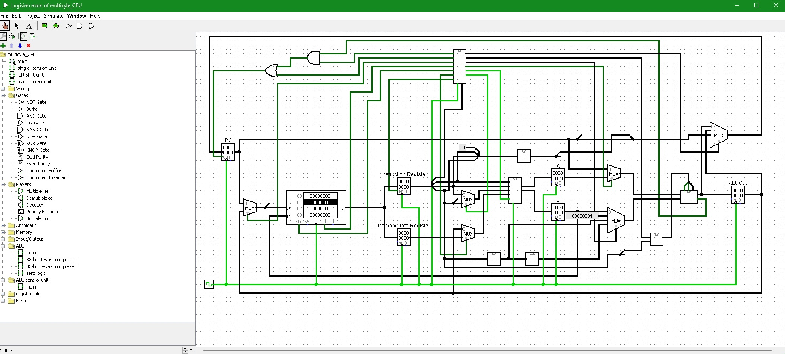

# Introduction

This project builds a multi-cycle CPU with hardware components in the simulator Logisim.

# Setup

To run the project, first extract everything to a specific folder, then open multicycle_CPU.circ in Logisim. All required libraries should be loaded successfully.

Next go to main control unit subcircuit. This control unit is implemented using a ROM. Right click on the ROM and click "Load Image", then load control unit mem.txt.

Next go back to the main circuit. Right click on the RAM and click "Load Image", then either load prog1.txt or prog2.txt into the memory. The programs are described below.

Finally, select a tick frequency in "Stimulate" -> "Tick Frequency".  Then check "Stimulate" -> "Ticks Enabled" to run the program. Both prog1.txt and prog2.txt will ultimately loop forever. To stop the program, uncheck "Ticks Enabled".

This is what the multi-cycle CPU looks like in Logisim:



# Built-in Programs

There are two programs, prog1.txt and prog2.txt, that can be used to test the multi-cycle CPU. The programs are written in machine code.

### Program 1: The Sum Program 

This program adds the numbers between A and B, inclusive, where A originally resides at address 44 hex in data memory and B resides in address 48 hex in data memory. The result is placed at data memory location 4c hex. Since there is no halt instruction on the MIPS processor, the program, after computing the result, will just loop (until you turn off the clock).

Here is the program in Assembly Code:

```
sub r0,r0,r0     ; set reg[0] to 0, use as base  
lw  r1,40(r0)     ; reg[1] <- mem[0] (= 1)  
lw  r2,44(r0)     ; reg[2] <- mem[4] (= A)  
lw  r3,48(r0)     ; reg[3] <- mem[8] (= B) 
sub r4,r4,r4     ; reg[4] <- 0, running total  
add r4,r2,r4     ; reg[4]+ = A  
slt r5,r2,r3     ; reg[5] <- A < B  
beq r5,r0,2      ; if reg[5] = FALSE, go forward 2 instructions  
add r2,r1,r2     ; A++  
beq r0,r0,-5     ; go back 5 instructions  
sw  r4,4c(r0)     ; mem[0] <- reg[4]  
beq r0,r0,-1     ; program is over, keep looping back to here 
```

For memory configuration (Program + Data), see prog1.txt

Based on the memory configuration in prog1.txt, the program will compute the sum of the numbers from 1 to 10,  inclusive. At the end of the program (when it is just looping) the result value, 55 decimal, should end up in data memory location 0. 

### Program 2: The AND/OR Program 

This program tests the processor's AND and OR operations, as well as testing addressing using offsets from a base register. The program starts with two variables, A and B, and does the following: 
 
- Computes A AND B and places the result in memory location 4 
- Computes A OR B and places the result in memory location 8 
  
Here is the program in Assembly Code: 
 
```
sub r0,r0,r0      ; set reg[0] to 0 
lw  r1,0(r0)      ; reg[1] <- mem[0] (= 20)  
lw  r2,0(r1)      ; reg[2] <- mem[20]  
lw  r3,4(r1)      ; reg[3] <- mem[24] 
and r4,r2,r3      ; reg[4] <- reg[2] AND reg[3]  
or  r5,r2,r3      ; reg[5] <- reg[2] OR reg[3]  
sw  r4,4(r0)      ; mem[4] <- reg[4]  
sw  r5,8(r0)      ; mem[8] <- reg[5]  
beq r0,r0,-1      ; program is over, loop back here  
```

For memory configuration (Program + Data), see prog2.txt

For this example, we'll set the values of A and B as follows: 
 
A:  430a1f9b hex 
B:  728cd2e3 hex 

So A AND B is: 42081283, A OR B is:  738edffb. A AND B is stored in location 44 hex, A OR B is stored in location 48 hex.
